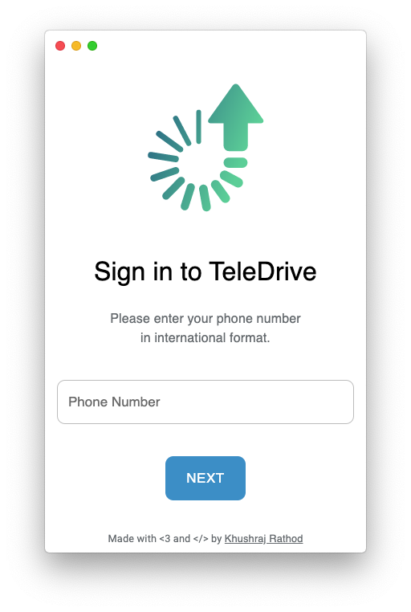
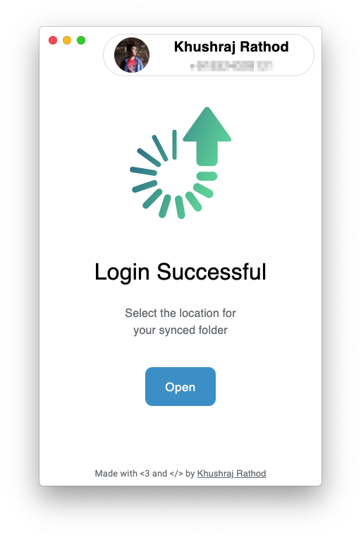
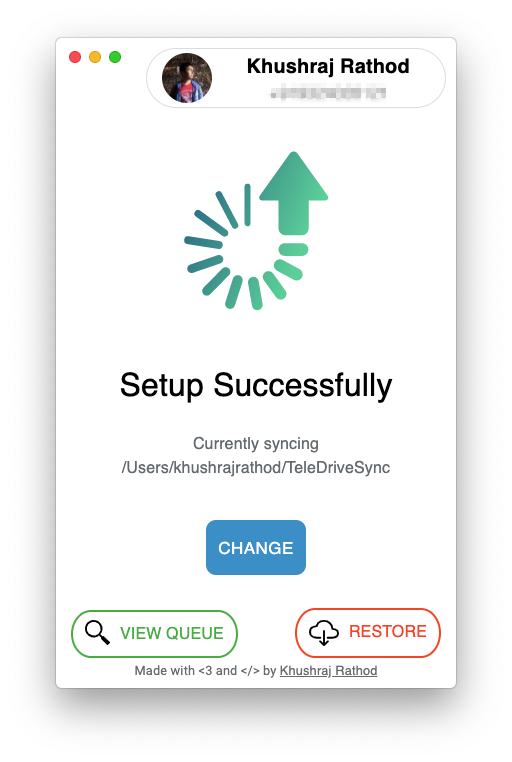
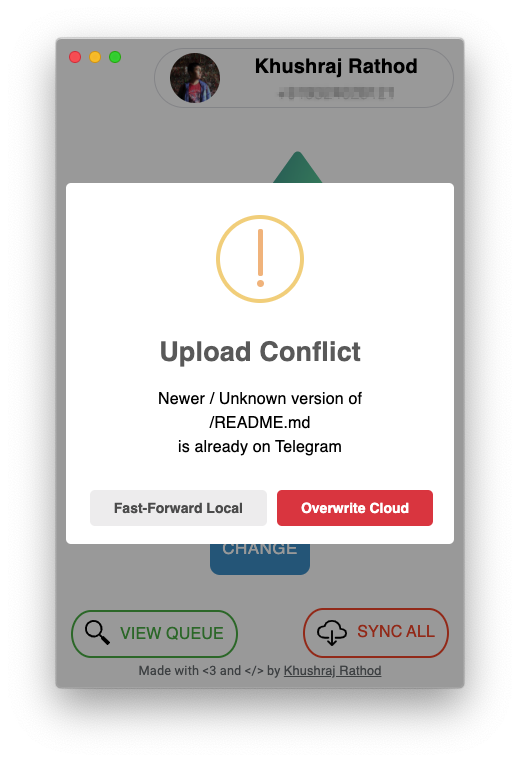

> TeleDrive lets you automatically backup ANY files to Telegram Saved Messages - this means **UNLIMITED** storage, as long as each file is under 2GB

<div align="center">
<a href="https://teledrive.khushrajrathod.me/api/?type=AppImage">
  
</a>

Download links: <br>
<a href="https://teledrive.khushrajrathod.me/api/?type=exe">Windows (NSIS)</a> --- <a href="https://teledrive.khushrajrathod.me/api/?type=dmg">macOS (DMG)</a>
</div>

---

Alternatively, for macOS, install using [homebrew](https://brew.sh/)
```bash
brew cask install --no-quarantine khushrajrathod/teledrive/teledrive
```
> See [code signing](https://github.com/khrj/TeleDrive/issues/10) for more info on why --no-quarantine is used

# Screenshots

   

# How does it work?
TeleDrive watches a folder for changes and automatically uploads any files contained within that folder to Telegram's saved messages. TeleDrive tags sub folders with their names, so when you restore your files using TeleDrive, you automatically get your folder structure back. For e.x if a TeleDrive's synced folder contains two sub folders, each containing one file:

```
TeleDriveSync ---- ----- Folder1 ----- MyFile1.txt
                 |
                 |
                 |
                 | ----- Folder2 ----- MyFile2.txt

```

Then TeleDrive will upload your files with the following tags:

- #TeleDrive /Folder1/MyFile1.txt
- #TeleDrive /Folder2/MyFile2.txt

This preserves your folder structure, even in a chat like Telegram's saved messages - This means that when you restore your files, you get the exact same folder structure back.

```
TeleDriveSync ---- ----- Folder1 ----- MyFile1.txt
                 |
                 |
                 |
                 | ----- Folder2 ----- MyFile2.txt
```

# Features

- Watch a folder for changes and automatically reupload when files are changed
- Preserve folder structure when restoring using TeleDrive
- Uses a master file for quickly finding messages and file versioning
- SHA256 based file versioning
- Queue viewer for uploads
- Built in conflict resolver
  - When there's a newer file on Saved Messages but you're trying to backup
- **NEW** Data analytics and statistics
  - View usage statistics, file information, and interaction metrics
- **NEW** Storage optimization
  - Compress files, clean temporary files, and remove duplicates
- **NEW** Enhanced connection monitoring
  - Real-time connection status and automatic reconnection
- **NEW** Quick actions
  - Pause, resume, and refresh synchronization with one click

# Running from source
1. Clone repository:
```bash
git clone https://github.com/khrj/TeleDrive
cd TeleDrive
```

2. Get dependencies:
```bash
yarn
```

3. Run:
```bash
# For Windows Command Prompt
set NODE_ENV=development && npx electron .

# For Windows PowerShell
$env:NODE_ENV="development"; npx electron .

# For Linux/macOS
NODE_ENV=development npx electron .

# Alternatively, use the included run.cmd file on Windows
run.cmd
```

# Troubleshooting

## Connection Issues
If you're experiencing connection issues:

1. Check your internet connection
2. Verify that your Telegram account is active
3. Try restarting the application
4. Check the logs at `%USERPROFILE%\AppData\Roaming\TeleDrive\logs` (Windows) or `~/Library/Application Support/TeleDrive/logs` (macOS)

## Authentication Problems
If you're having trouble authenticating:

1. Make sure you're using the correct phone number in international format
2. Check that you have a valid Telegram account
3. If using 2FA, ensure your password is correct
4. Try clearing the application data and starting fresh

# Built with:

- [Electron](https://www.electronjs.org/)
- [Electron Builder](https://www.electron.build/)
- [Airgram](https://airgram.io/)
- [Chokidar](https://github.com/paulmillr/chokidar)
- [Electron Store](https://github.com/sindresorhus/electron-store#readme)
- [ncp](https://github.com/AvianFlu/ncp)
- [Electron Log](https://github.com/megahertz/electron-log)

# License:
- TeleDrive is licensed under the GPLv3 license
